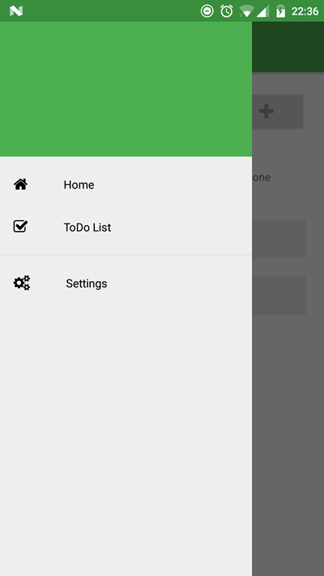

# NativeScript Ng2 Drawer Seed



Nativescript seed project with [nativescript-telerik-ui](https://www.npmjs.com/package/nativescript-telerik-ui) 
drawer support integrated and ready to be used.

To test the app just clone the repository and run:
```shell
$ tns run android
```

Meteor integration under the [meteor](https://github.com/ntrp/nativescript-ng2-drawer-seed/tree/meteor) branch.